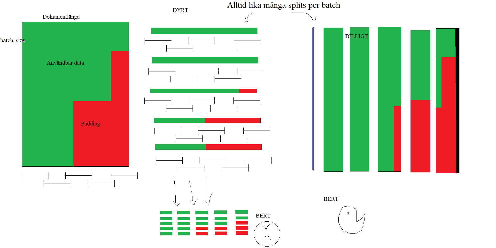
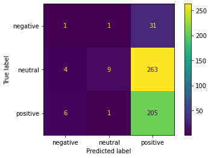
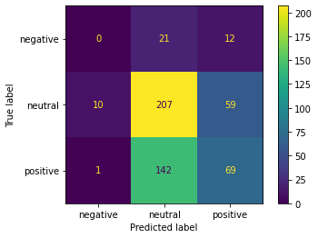

# DocBERT for financial news classification
## Project description
In this three week long project we investigated domain transfer between sentiment analysis for reviews to sentiment analysis for stock-related news, compared to sentiment analysis for financial phrases (found labeled on huggingface) to sentiment analysis for financial news. In order to be able to process and classify large documents such as news articles, we implemented a so called DocBERT based on [this](https://arxiv.org/pdf/1910.10781.pdf) article. The main principle is to segment the document into chunks with overlap, which leads to a time complexity of $O(n)$ instead of $O(n^2)$, which a transformer usually has due to the attention mechanism. 

The news articles that we tested on where gathered, and marked as positive/neutral/negative based on the stock price movement within 5 minutes after the news article was published. The tresholds for a positive/negative news article was a movement of + or - 3% respectively.

## Further modifications
When DocBERT was implemented, it was still a bit slow due to the varying lengths of the documents, since all entries in a batch need to be padded to the same length. One way to mitigate this a bit, which we implemented is to sort the entries by length to minimize the unneccesary padding, and thus the length of our batches. You can see this visualized in an image we drew in ms-paint one late evening. This image also shows how the splitting was made, in order to ensure that an equal amount of splits were made each batch. 

# Results.
Unsurprisingly, the sentiment of financial phrases ended up having better domain transfer to financial news compared to amazon reviews. The final results on the gathered testing data can be seen in the following confusion matrixes.

**The performance of the model trained on amazon reviews**

**The performance of the model trained on financial phrases**

# Status reports
During the project we made weekly status reports for the examiner, these can be found here. 

## TDDE09 Project status report week 2
### What has been done
This week we sucessfully implemented a docbert which is able to process larger documents in an efficient manner. Our own collected news were nicely processed, and we got started on our presentation and abstract for the report.

### What will be done the comming week
This week we will have a lot to do. 

 - [x] Firtly, we should experiment with how a difference in text-length in the training dataset compared to the testing dataset can affect prediction quality. I propose that we do this by finding a labeled dataset with a lot of variance in length, and split this dataset into 3 sets, one with the longer documents, one with middle long document and one with the shortest documents. Then we should train a model on the middle and short datasets and evaluate these on the long dataset. Note. The short and the middle dataset should have an equal amount of entries.

 Instead of short, medium long and long, we have dataset with the same document length as our training dataset and test dataset. No significant difference was seen.

- [x] Secondly, we should process the rest of our data similarly to how the own-collected news were processed.

- [x] We should also thoroughly examine our litterature, mainly the [text-splitting with overlap article](https://arxiv.org/pdf/1904.08398.pdf) and the [original docbert article](https://arxiv.org/pdf/1910.10781.pdf), to see if anything is missing in our BERT arcitechture.

- [x] Furthermore, we should train a BERT on our training datasets and evaluate it on the test dataset. 

### Current problems
Besides a lot of work in front of us, we do not have any current problems.

## TDDE09 Project status report week 1
### What has been done
Starting with what we are supposed to have done. 
-	Gather and label data (this refers to our own collected news), DONE.
-	Clean up, label and tokenize collected news, DONE
-	Translate financial dataset and change both datasets to a uniform labelling system DONE
-	Import a Swedish bert and set up for document classification (SEMI-DONE)
We have set up a bertForSequenceClassification in a nearly identical way to lab3x, and have been able to fine-tune this model on a dataset of financial phrases. This model achieved 88.6% accuracy on a held out dataset of similar manner.
The same model preformed with an accuracy of 39% on a small sample of the translated amazon-reviews from our review dataset, this was a bit underwhelming, but also understandable given the dissimilarity of the subjects. 
### Current problems
1.	No setup for docbert currently. A problem we are facing is that the amazon-reviews (max length 1232 words) and some of our own collected news, are way longer than the financial phrases (max length 78 words). In this article https://arxiv.org/pdf/1910.10781.pdf the authors suggest splitting long pieces of tokens into segments of a fixed size with overlap and feeding these into an LSTM. This might prove to be difficult.
2.	Our Swedish dataset of reviews turned out to be labelled sub-optimally. We have addressed this by switching review dataset to a set of amazon reviews which we have translated.
3.	Training is taking long. Fine tuning a BERT on the set of financial phrases, 4000 sentences between 2 and 78 words long, took about 40 minutes. We believe that this will take even longer for the long amazon-reviews. We have tried to mitigate this by saving this model so that we can load it without training it again, and by sorting sentences by length before batchifying. The sorting improved performance slightly.

### What will be done this week
This week we will preform the experiments, and hopefully address our current problems in an efficient manner. We will start by contacting the examiner of the course in hope of receiving some guidance. 
